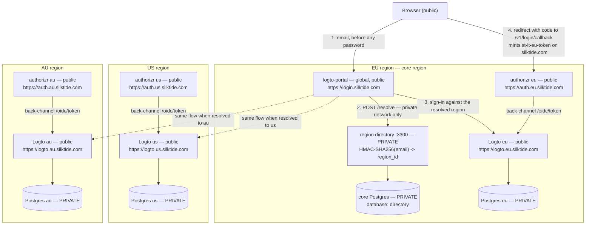
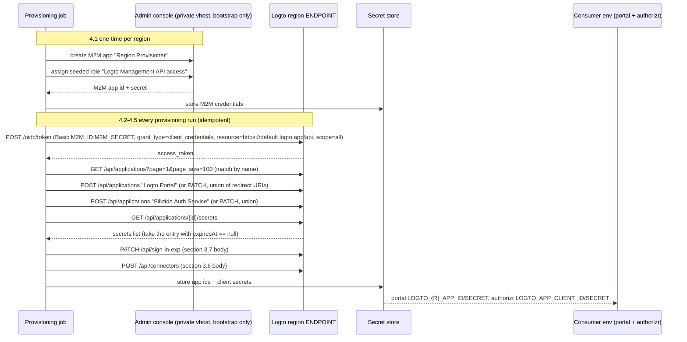
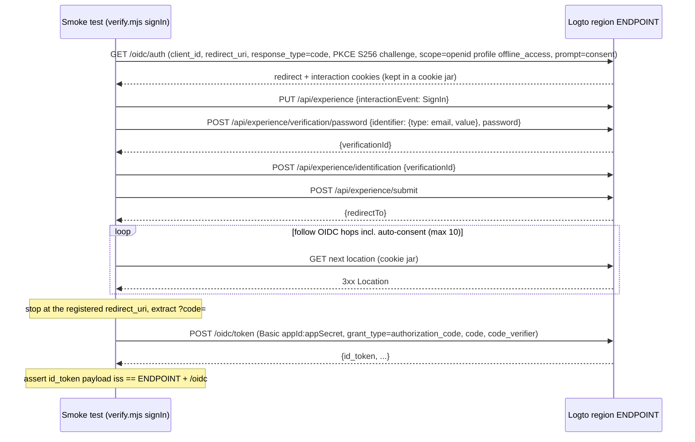

# Silktide Logto — production deployment runbook

Platform-agnostic runbook for the Silktide fork of Logto: processes, environment
variables, external dependencies, boot order, provisioning, health checks,
upgrade path and verification. No Kubernetes/Terraform manifests. The dev
harness (`docker-compose.multi-region.yml` + `ops/multi-region/`) is explicitly
NOT this document — it exists to exercise the topology locally and is unsafe
for production (see the `INTEGRATION_TEST` warnings throughout).

Companion documents in the sibling repos:

- the logto-portal repo → `DEPLOYMENT.md` (the single global login portal)
- the silktide-qa repo → `docs/yak-backend-deployment.md` (authorizr, controllr,
  Marvel integration, and the Auth0 cutover)

---

## 1. Topology

There are N fully independent Logto deployments, one per region (`eu`, `us`,
`au` — lowercase, everywhere), each with its own Postgres, its own OIDC issuer
and its own signing keys. All PII lives in-region.

The EU region is the **core region**: it runs a full normal-region stack PLUS
the global components — a separate core Postgres instance, the region directory
service (`:3300`, maps `HMAC-SHA256(email) -> region_id`), and the single
global login portal at `https://login.silktide.com` (deployed per the
logto-portal repo's `DEPLOYMENT.md`; cross-referenced only here). The only
global datastore holds keyed hashes, never a plaintext identifier.

Login flow: the portal resolves email → region via the core directory BEFORE
showing a password field, drives that region's Logto, and the browser is
redirected to that region's authorizr at `/v1/login/callback`, which mints the
`st-lt-{REGION_ID}-token` cookie on the root domain (`.silktide.com`).



Public components take internet traffic through a TLS-terminating proxy. The
directory service and every Postgres are private-network only — no public DNS,
no public ingress.

### Naming (single source for placeholders used throughout)

| Placeholder | Production value | Staging |
|---|---|---|
| `{REGION}` | `eu`, `us`, `au` (lowercase, everywhere) | same |
| Logto endpoint | `https://logto.{REGION}.silktide.com` | `https://logto.{REGION}.silktide.dev` |
| Logto admin endpoint (private) | `https://logto-admin.{REGION}.silktide.com` — private network only | same shape |
| Authorizr origin | `https://auth.{REGION}.silktide.com` — today this hostname is Auth0's custom domain; the handover IS the cutover (gap 10) | same shape |
| Portal | `https://login.silktide.com` (single global instance) | `https://login.silktide.dev` |
| Directory | private URL, e.g. `http://directory.core.internal:3300` — never public | — |
| Cookie parent domain | `silktide.com` (authorizr `ROOT_DOMAIN`) | `silktide.dev` |

**`ENDPOINT` is the OIDC issuer prefix** — the issuer is exactly
`ENDPOINT + /oidc`. Changing it invalidates every outstanding token and every
SDK configuration; treat it as immutable per region.

---

## 2. Building the production image

Build from THIS fork, never from upstream and never by pulling `svhd/logto`
from Docker Hub. Two reasons:

- the fork may carry Silktide changes;
- the fork's image ships `ops/` inside `/etc/logto` (the `Dockerfile` does
  `COPY . .`), which section 5 relies on to run the directory service. The
  upstream Docker Hub image does not contain `ops/` — verified empirically.
  (Nothing in `.dockerignore` excludes `ops/`, so `ops/multi-region/` and
  `ops/oidc-retention/` are copied into the image by `COPY . .` —
  empirically verified.)

The repo `Dockerfile` builds the all-in-one core + admin-console image:
`node:22-alpine`, `pnpm i && pnpm -r build`, official connectors linked
(including `connector-smtp`), then a production prune. `EXPOSE 3001`,
`ENTRYPOINT ["npm", "run"]`, `CMD ["start"]` where the root `start` script is
`cd packages/core && npm start`. The Logto CLI is available inside the
container as `npm run cli <args>` (flags need a `--` separator, e.g.
`npm run cli db seed -- --swe`).

BuildKit is required (`# syntax=docker/dockerfile:1.7` plus cache mounts):

```bash
docker buildx build \
  --tag registry.silktide.com/silktide-logto:<logto-version>-<git-sha> \
  /path/to/logto
```

Build args (all verified against `Dockerfile`):

| Arg | Production setting | Why |
|---|---|---|
| `dev_features_enabled` | leave unset | `DEV_FEATURES_ENABLED` must stay off. Note `isDevFeaturesEnabled` is true whenever `NODE_ENV !== 'production'` (`packages/shared/src/node/env/GlobalValues.ts`), so also always run with `NODE_ENV=production` |
| `logto_oss_survey_endpoint` | leave unset (defaults empty) | keeps OSS survey relaying off |
| `applicationinsights_connection_string` | leave unset unless using App Insights | telemetry |
| `additional_connector_args` | leave unset | official connectors incl. `connector-smtp` are already linked |
| `private_key_rotation_grace_period` | optional bake-in (defaults `0`); prefer the runtime env var | see key rotation, section 6.3 |

One image serves both surfaces from one process: core on `PORT` (3001) and the
admin console on `ADMIN_PORT` (3002). The same image is reused as the runtime
for the directory service (section 5.2) and as the CLI runner for migrations
(section 6.4).

---

## 3. Per-region Logto deployment (repeat for eu, us, au)

### 3.1 External dependencies

- **PostgreSQL** — one dedicated instance per region (the dev harness pins
  `postgres:17-alpine`; recommend 17.x). Never shared with the core Postgres or
  with another region: "core" and "regional" are different databases on
  different hosts, not different schemas in one.
- **Reverse proxy** terminating TLS for `logto.{REGION}.silktide.com` (and the
  private `logto-admin.{REGION}` vhost if used).
- **Redis** — REQUIRED when running more than one Logto node in a region
  (`REDIS_URL` enables the central cache; without it multi-node cache
  invalidation is broken). Optional for a single node. Reuse the per-region
  Redis that already exists for the Yak stack, on a distinct logical DB.
- **SMTP relay** for the email connector (3.6).

### 3.2 Environment

Verified against `packages/shared/src/node/env/GlobalValues.ts` and
`packages/shared/src/node/env/UrlSet.ts`. Never put secret values in compose
or manifest files — inject from the secret store.

| Variable | Value | Notes |
|---|---|---|
| `NODE_ENV` | `production` | also gates dev features and the dev-user auth bypass off |
| `DB_URL` | `postgres://logto:<password>@<region-pg-host>:5432/logto` | must be the schema OWNER role — used by seed, alterations and the retention sweep (OSS default runtime role) |
| `ENDPOINT` | `https://logto.{REGION}.silktide.com` | issuer prefix; immutable (section 1) |
| `PORT` | `3001` (default) | container port from `Dockerfile` `EXPOSE` |
| `ADMIN_ENDPOINT` | see 3.5 | private vhost during bootstrap, or unset |
| `ADMIN_PORT` | `3002` (default) | |
| `ADMIN_DISABLE_LOCALHOST` | `1` after bootstrap (see 3.5) | with `ADMIN_ENDPOINT` unset this disables the admin/console surface entirely (documented lever on `adminUrlSet` in `GlobalValues.ts`) |
| `DISABLE_LOCALHOST` | leave unset (recommended) | removes the core localhost URL from the URL set; only set it if health checks go through the proxy, since it also removes the plain-HTTP localhost listener target used by sidecar checks |
| `TRUST_PROXY_HEADER` | `1` | required behind the TLS-terminating proxy so redirect/issuer URLs honour `X-Forwarded-*` |
| `REDIS_URL` | `redis://...` | required multi-node; enables the central cache |
| `INTEGRATION_TEST` | **must be unset** | a truthy value disables Management API token validation (`packages/core/src/middleware/koa-auth/index.ts`). **Never in production.** |
| `DEV_FEATURES_ENABLED` | unset | |
| `DEVELOPMENT_USER_ID` | unset | feeds the same auth bypass as `INTEGRATION_TEST`; inert when `NODE_ENV=production` and `INTEGRATION_TEST` is unset, but never set it |
| `STATUS_API_KEY` | optional random string | `GET /api/status` with header `logto-status-api-key: <key>` adds a `logto-tenant-id` response header (`packages/core/src/routes/status.ts`); the endpoint always answers 204 regardless |
| `DATABASE_POOL_SIZE` | default `20` | tune to instance size |
| `DATABASE_CONNECTION_TIMEOUT` | default `5000` (ms) | |
| `DATABASE_STATEMENT_TIMEOUT` | numeric ms, or `DISABLE_TIMEOUT` when behind PgBouncer/RDS Proxy | parse rules in `GlobalValues.ts` |
| `PRIVATE_KEY_ROTATION_GRACE_PERIOD` | recommend `3600` (seconds) | default grace for signing-key rotation (section 6.3) |
| `SECRET_VAULT_KEK` | only if secret-vault features are used | |
| `HTTPS_CERT_PATH` / `HTTPS_KEY_PATH` | unset | the proxy terminates TLS |
| `OIDC_PROVIDER_SSRF_PROTECTION_DISABLED`, `PATH_BASED_MULTI_TENANCY`, `IS_CLOUD`, glob `ENDPOINT` | never set | hardening: keep SSRF protection on; no multi-tenancy modes |

### 3.3 Database initialization and boot order

1. Provision Postgres; create database `logto` owned by role `logto`.
2. First boot and every boot (idempotent), run as the container command:

   ```
   sh -c "npm run cli db seed -- --swe && npm start"
   ```

   (the dev compose files use exactly this entrypoint). `--swe` =
   `--skip-when-exists`: the seed is skipped when the `logto_configs` table
   already exists (`packages/cli/src/commands/database/seed/index.ts`). The
   seed creates the schema, the default tenant, the OIDC private key and
   cookie keys, the Management API resource (`https://default.logto.app/api`,
   scope `all`), and — load-bearing for section 4 — the pre-configured M2M
   role **`Logto Management API access`**
   (`packages/cli/src/commands/database/seed/roles.ts`).
3. Upgrades: `npm run cli db alteration deploy latest` with the NEW image
   against the same `DB_URL`, then roll the containers. Command shape:
   `logto db alteration <action> [target]`, actions `list | deploy | rollback`
   (`rollback-to-timestamp` also exists). Full procedure in section 6.4.
4. Boot order per region: Postgres healthy → Logto (seed + start) → proxy
   live. Health gate: `GET http://<node>:3001/api/status` → `204`.

### 3.4 Reverse proxy / TLS assumptions

- Terminate TLS at the edge; forward `Host`, `X-Forwarded-Proto`,
  `X-Forwarded-For`; `TRUST_PROXY_HEADER=1` set.
- LB health check: `/api/status` (204, unauthenticated).
- Do not route `logto-admin.{REGION}` (if used) on the public edge — private
  network / VPN with an IP allowlist only.

### 3.5 Admin console exposure policy

- **Bootstrap phase**: run with
  `ADMIN_ENDPOINT=https://logto-admin.{REGION}.silktide.com` on a private
  vhost. The first visit to the console creates the OSS admin user — do this
  immediately after first boot, before the vhost is reachable by anyone else.
  Create the provisioning M2M app here (section 4.1).
- **Steady state (recommended)**: set `ADMIN_DISABLE_LOCALHOST=1` and unset
  `ADMIN_ENDPOINT` — the console and the admin-tenant surface are not served
  at all. The Management API is unaffected: it is served on the main
  `ENDPOINT` under `/api/*` and authenticated by M2M tokens, so all automation
  keeps working.
- **Tradeoff**: with the console off, ad-hoc human tasks (inspecting a user,
  tweaking sign-in-experience copy) require either Management API calls or a
  temporary redeploy with the private `ADMIN_ENDPOINT` restored. A permanently
  private `ADMIN_ENDPOINT` is acceptable if the network boundary is real
  (VPN + SSO at the proxy); the console-off posture removes the whole class of
  admin-surface exposure and is the recommendation once provisioning is
  automated.

### 3.6 Email connector (connector-smtp)

Configure via the Management API (token from section 4.2):

```
POST {ENDPOINT}/api/connectors
{ "connectorId": "simple-mail-transfer-protocol", "config": { ... } }
```

The connector id is from `packages/connectors/connector-smtp/src/constant.ts`.
Config schema (`packages/connectors/connector-smtp/src/types.ts`): required
`host`, `port` (number), `auth` (`{user, pass}` — both fields optional so
IP-authorised relays that take no credentials still validate), `fromEmail`;
optional `replyTo`, `secure` (default `false`), `requireTLS`. The `templates`
array is required and MUST include usageTypes `Register`, `SignIn`,
`ForgotPassword` and `Generic` — the zod refine rejects the config otherwise.

Worked example (`{{code}}` is substituted by Logto; `contentType` is
`text/html` or `text/plain`):

```json
{
  "connectorId": "simple-mail-transfer-protocol",
  "config": {
    "host": "<smtp-relay-host>",
    "port": 587,
    "auth": { "user": "<smtp-user>", "pass": "<smtp-password-from-secret-store>" },
    "fromEmail": "no-reply@silktide.com",
    "requireTLS": true,
    "templates": [
      { "usageType": "SignIn", "contentType": "text/plain",
        "subject": "Your Silktide sign-in code",
        "content": "Your verification code is {{code}}." },
      { "usageType": "Register", "contentType": "text/plain",
        "subject": "Your Silktide verification code",
        "content": "Your verification code is {{code}}." },
      { "usageType": "ForgotPassword", "contentType": "text/plain",
        "subject": "Reset your Silktide password",
        "content": "Your password reset code is {{code}}." },
      { "usageType": "Generic", "contentType": "text/plain",
        "subject": "Your Silktide verification code",
        "content": "Your verification code is {{code}}." }
    ]
  }
}
```

Note: sign-in is password-only (3.7), so the `SignIn` and `Register` templates
exist to satisfy the schema; `ForgotPassword` and `Generic` are the ones users
will actually receive.

### 3.7 Sign-in experience policy

`PATCH {ENDPOINT}/api/sign-in-exp` with exactly the body from
`ops/multi-region/seed.mjs` `useEmailSignIn`:

```json
{
  "signUp": { "identifiers": [], "password": false, "verify": false },
  "signInMode": "SignIn",
  "signIn": { "methods": [ { "identifier": "email", "password": true,
      "verificationCode": false, "isPasswordPrimary": true } ] }
}
```

Rationale (condensed from `ops/multi-region/seed.mjs` and
`ops/multi-region/README.md`): self-service sign-up is OFF — a user's region
is decided at provisioning time, so accounts arrive via the Management API or
a migration, never an anonymous form. Turning sign-up off also avoids the
`passwordless_requires_verify` and `user.missing_profile` pitfalls. An
optional branding `PATCH` to the same route can follow.

---

## 4. Production provisioning per region (no INTEGRATION_TEST)

The dev seed (`ops/multi-region/seed.mjs`) authenticates with the
`development-user-id` header, which only works under `INTEGRATION_TEST=1` —
**prohibited in production because it disables Management API token
validation** (`packages/core/src/middleware/koa-auth/index.ts`). Production
replaces that one mechanism with an M2M client-credentials token; every other
API call below mirrors `seed.mjs`, with one deliberate divergence: the
`Silktide Auth Service` post sign-out URI is `/v1/logout/callback` (4.3),
where the dev seed registers only the service origin (see the silktide-qa
repo's `docs/yak-backend-deployment.md`, Section 7). This section is the canonical
description of the M2M provisioning flow — the portal and silktide-qa
deployment docs cross-reference it rather than restating it.



### 4.1 One-time M2M bootstrap (per region, via the private admin console)

1. In the console: Applications → create a **Machine-to-machine** app, name
   `Region Provisioner`.
2. Assign it the seeded role **`Logto Management API access`** (grants scope
   `all` on the resource `https://default.logto.app/api`).
3. Record its App ID and App Secret in the secret store.

Escape hatch for console-less environments: `POST /api/applications` plus
`POST /api/roles/:id/applications {"applicationIds": [...]}` — but those calls
themselves need a token, so the first M2M app in each region is a console
task.

### 4.2 Getting a Management API token

```bash
curl -s -u "$M2M_ID:$M2M_SECRET" \
  -d grant_type=client_credentials \
  -d resource=https://default.logto.app/api \
  -d scope=all \
  "$ENDPOINT/oidc/token"
```

The resource indicator is the FIXED string `https://default.logto.app/api` for
the default tenant (`packages/schemas/src/seeds/management-api.ts`) — it is an
identifier, not a URL to call. All subsequent calls send
`Authorization: Bearer <access_token>` against `{ENDPOINT}/api/...`.

### 4.3 Create the two confidential apps (mirroring seed.mjs `ensureApp`)

For each app: look up by name first
(`GET /api/applications?page=1&page_size=100`, match on `name`); if absent,
create; if present, `PATCH` to reconcile redirect URIs **by union** — never
replace (re-running with a new callback must add it, not fail later with
`invalid_redirect_uri`). The app display names are the idempotent reconcile
keys — **never rename them**.

App 1 — **`Logto Portal`** (identical in every region; the portal is global):

```json
POST /api/applications
{ "name": "Logto Portal", "type": "Traditional",
  "description": "Region-aware login portal",
  "oidcClientMetadata": {
    "redirectUris": ["https://login.silktide.com/callback"],
    "postLogoutRedirectUris": ["https://login.silktide.com"] } }
```

App 2 — **`Silktide Auth Service`** (per-region URIs):

```json
POST /api/applications
{ "name": "Silktide Auth Service", "type": "Traditional",
  "description": "authorizr — redeems the code, owns state + PKCE",
  "oidcClientMetadata": {
    "redirectUris": ["https://auth.{REGION}.silktide.com/v1/login/callback"],
    "postLogoutRedirectUris": ["https://auth.{REGION}.silktide.com/v1/logout/callback"] } }
```

Notes:

- The callback paths are load-bearing constants in the silktide-qa repo
  (`services/authorizr/src/paths.ts`: `LOGIN_CALLBACK_PATH` =
  `/v1/login/callback`, `LOGOUT_CALLBACK_PATH` = `/v1/logout/callback`).
- Logto `Traditional` apps default to `client_secret_basic` token-endpoint
  auth, which authorizr requires — its `src/logto/http-logto-oidc.ts` relies
  on Logto's `pkce.required = clientAuthMethod !== 'client_secret_basic'`
  behaviour.

### 4.4 Fetch the real client secrets

The `secret` field on the application object is `#internal:`-prefixed and NOT
a usable OIDC secret (see `appSecretOf` in `ops/multi-region/seed.mjs`).
Client secrets come ONLY from:

```
GET /api/applications/{id}/secrets
```

Take the entry with `expiresAt == null` — its `value` is the client secret.

### 4.5 Configure sign-in experience and connector

Run section 3.7's `PATCH /api/sign-in-exp` and section 3.6's connector `POST`
with the same token. Both are idempotent.

### Consolidated worked script (4.2 → 4.5)

This is the production replacement for `ops/multi-region/seed.mjs`.
Parameterised by `REGION`, `ENDPOINT`, `M2M_ID`, `M2M_SECRET`; requires
`curl` and `jq`. It prints app ids only — write secrets straight to the secret
store, never to logs.

```bash
#!/usr/bin/env bash
# Provision one region's Logto: apps, sign-in experience, (optionally) SMTP.
set -euo pipefail

: "${REGION:?eu | us | au (lowercase)}"
: "${ENDPOINT:?e.g. https://logto.${REGION:-eu}.silktide.com}"
: "${M2M_ID:?Region Provisioner app id}"
: "${M2M_SECRET:?Region Provisioner app secret}"

PORTAL_CALLBACK="https://login.silktide.com/callback"
PORTAL_ORIGIN="https://login.silktide.com"
AUTH_CALLBACK="https://auth.${REGION}.silktide.com/v1/login/callback"
AUTH_LOGOUT_CALLBACK="https://auth.${REGION}.silktide.com/v1/logout/callback"

# 4.2 Management API token. The resource is the FIXED indicator string.
TOKEN=$(curl -fsS -u "$M2M_ID:$M2M_SECRET" \
  -d grant_type=client_credentials \
  -d resource=https://default.logto.app/api \
  -d scope=all \
  "$ENDPOINT/oidc/token" | jq -r .access_token)

api() { # api METHOD PATH [JSON_BODY]
  local method=$1 path=$2 body=${3-}
  if [ -n "$body" ]; then
    curl -fsS -X "$method" "$ENDPOINT/api$path" \
      -H "authorization: Bearer $TOKEN" \
      -H "content-type: application/json" -d "$body"
  else
    curl -fsS -X "$method" "$ENDPOINT/api$path" \
      -H "authorization: Bearer $TOKEN"
  fi
}

# 4.3 ensure_app NAME DESCRIPTION CALLBACK POST_LOGOUT -> app id on stdout.
# Name is the reconcile key; URIs are reconciled by UNION, never replaced.
ensure_app() {
  local name=$1 description=$2 callback=$3 post_logout=$4 existing id
  existing=$(api GET "/applications?page=1&page_size=100" |
    jq --arg n "$name" '[.[] | select(.name == $n)] | first')
  if [ "$existing" = "null" ]; then
    api POST /applications "$(jq -n --arg n "$name" --arg d "$description" \
        --arg cb "$callback" --arg pl "$post_logout" \
      '{name: $n, type: "Traditional", description: $d,
        oidcClientMetadata: {redirectUris: [$cb], postLogoutRedirectUris: [$pl]}}')" |
      jq -r .id
  else
    id=$(jq -r .id <<<"$existing")
    api PATCH "/applications/$id" "$(jq --arg cb "$callback" --arg pl "$post_logout" \
      '{oidcClientMetadata: (.oidcClientMetadata
         | .redirectUris = ((.redirectUris + [$cb]) | unique)
         | .postLogoutRedirectUris = ((.postLogoutRedirectUris + [$pl]) | unique))}' \
      <<<"$existing")" >/dev/null
    echo "$id"
  fi
}

# 4.4 The application object's own "secret" field is "#internal:"-prefixed and
# unusable. The real client secret comes ONLY from /secrets.
app_secret() {
  api GET "/applications/$1/secrets" |
    jq -r '[.[] | select(.expiresAt == null)] | first | .value'
}

PORTAL_APP_ID=$(ensure_app "Logto Portal" \
  "Region-aware login portal" "$PORTAL_CALLBACK" "$PORTAL_ORIGIN")
AUTH_APP_ID=$(ensure_app "Silktide Auth Service" \
  "authorizr — redeems the code, owns state + PKCE" \
  "$AUTH_CALLBACK" "$AUTH_LOGOUT_CALLBACK")

# 4.5a Sign-in experience (body mirrors ops/multi-region/seed.mjs verbatim).
api PATCH /sign-in-exp '{
  "signUp": { "identifiers": [], "password": false, "verify": false },
  "signInMode": "SignIn",
  "signIn": { "methods": [ { "identifier": "email", "password": true,
      "verificationCode": false, "isPasswordPrimary": true } ] }
}' >/dev/null

# 4.5b SMTP connector -- uncomment with a vetted smtp-config.json (section 3.6):
# api POST /connectors "$(jq -n --slurpfile c smtp-config.json \
#   '{connectorId: "simple-mail-transfer-protocol", config: $c[0]}')" >/dev/null

echo "region:           $REGION"
echo "portal app id:    $PORTAL_APP_ID"
echo "authorizr app id: $AUTH_APP_ID"
# Hand the secrets to the secret store out-of-band, e.g.:
#   app_secret "$PORTAL_APP_ID" | <secret-store-cli> put "logto/${REGION}/portal-app-secret"
#   app_secret "$AUTH_APP_ID"   | <secret-store-cli> put "logto/${REGION}/authorizr-app-secret"
```

### 4.6 Provisioning users (steady-state runbook)

Order (hardened relative to `seed.mjs`):

1. `POST {DIRECTORY}/resolve {"identifier": "<email>"}` — if it resolves to a
   DIFFERENT region, **stop**: this is a residency conflict, not a create.
2. `POST {ENDPOINT}/api/users {"primaryEmail": "...", "name": "...", "password": "..."}`
   in the target region (422 = already exists; look up via
   `GET /api/users?search=<email>`).
3. `PUT {DIRECTORY}/entries {"identifier": "<email>", "region": "{REGION}"}`
   with `Authorization: Bearer $DIRECTORY_ADMIN_TOKEN`. Responses:
   `201` created; `200` idempotent same-region; **`409` = already assigned to
   another region → abort and escalate (section 5.5)**; `400` = unknown region
   id (a directory foreign-key rejection).

Auth0 note: migrated accounts arrive through exactly this Management API path
(which is why self-signup stays off — section 3.7). The Auth0-side export and
the cutover sequencing are documented in the silktide-qa repo's
`docs/yak-backend-deployment.md` — cross-reference it; this doc does not
restate it.

### 4.7 Output → consumer env mapping

Exact names verified in the logto-portal repo (`app/logto.ts`,
`app/auth-service.ts`) and the silktide-qa repo
(`services/authorizr/src/env.ts`). `{R}` = `EU`/`US`/`AU` uppercase.

| Produced value | logto-portal (global, one env) | authorizr (one deployment per region) |
|---|---|---|
| region endpoint | `LOGTO_{R}_ENDPOINT` | `LOGTO_ENDPOINT` |
| `Logto Portal` app id / secret | `LOGTO_{R}_APP_ID` / `LOGTO_{R}_APP_SECRET` | — |
| `Silktide Auth Service` app id / secret | — | `LOGTO_APP_CLIENT_ID` / `LOGTO_APP_CLIENT_SECRET` |

(The dev seed prints `LOGTO_{R}_APP_CLIENT_ID` names because its dev auth
service is one process serving every region; production authorizr is deployed
per region and reads the unprefixed names.)

The portal additionally needs `DIRECTORY_URL`, `AUTH_SERVICE_{R}_URL`,
`AUTH_SERVICE_INTERNAL_SECRET`, `LOGTO_BASE_URL` and `LOGTO_COOKIE_SECRET` —
documented in the logto-portal repo's `DEPLOYMENT.md`; listed here only as the
hand-off contract. Secret pairings that must match across deployments: the
portal's `AUTH_SERVICE_INTERNAL_SECRET` equals every regional authorizr's
`INTERNAL_API_SECRET` (one shared value); `MARVEL_INTERNAL_SECRET` pairs
authorizr with Marvel; `DIRECTORY_ADMIN_TOKEN` is shared only with
provisioning tooling; `DIRECTORY_HMAC_KEY` never leaves the directory service.
Do not copy values from the orphaned pre-rename `services/yak/.env.local` or
`services/auth/.env.local` files in silktide-qa (gap 11).

---

## 5. Core region extras (EU only)

EU is a normal region — all of sections 3–4 apply — PLUS everything below.
The global portal deployment itself is covered by the logto-portal repo's
`DEPLOYMENT.md`; this section covers the directory service and the core
Postgres.

### 5.1 Core Postgres

- A separate instance from EVERY regional Logto database ("different databases
  on different hosts, not different schemas in one" —
  `docker-compose.multi-region.yml`). Database `directory`, dedicated role.
- Tiny footprint: two tables (`regions`, `region_directory`) and one index.
  Standard backups — but it is the only global state: losing it strands login
  routing for everyone, so treat its backup/restore as tier-1.

### 5.2 Deploying the directory service

Code: `ops/multi-region/directory/server.mjs` — dependency-light (`node:http`,
`node:crypto`, `pg`). Two supported runtimes:

1. **(Recommended)** the silktide-logto image itself: the fork's `Dockerfile`
   `COPY . .` ships `ops/` into `/etc/logto`, and `pg` resolves from
   `/etc/logto/node_modules` (the same upward-resolution mechanism the dev
   compose uses). Command:

   ```
   node /etc/logto/ops/multi-region/directory/server.mjs
   ```

   Mandatory deploy-time check (both facts are environmental, not declared:
   `pg` is only a root devDependency that happens to survive the production
   prune, and upstream-published images do not contain `ops/` at all):

   ```bash
   docker run --rm --entrypoint sh <image> -c \
     "test -f /etc/logto/ops/multi-region/directory/server.mjs && node -e \"import('pg')\"" \
     && echo OK
   ```

2. Any Node ≥ 20 runtime with `pg` installed alongside `server.mjs`.

Environment (all three required — the process exits otherwise, verified in
`server.mjs`):

| Var | Value | Notes |
|---|---|---|
| `PORT` | `3300` (default) | |
| `DIRECTORY_HMAC_KEY` | ≥ 32 random bytes, from the secret store | **STABLE FOREVER**: rotating it orphans every entry; recovery requires re-registering every user from each region's user list (plaintext emails only exist in-region). Never log it. It never leaves this service. |
| `DIRECTORY_ADMIN_TOKEN` | strong random value | shared only with provisioning tooling; auths `PUT /entries` and `GET /entries` (timing-safe compare) |
| `DIRECTORY_DB_URL` | `postgres://directory:<password>@<core-pg-host>:5432/directory` | |

Boot behaviour (`server.mjs`): waits up to 60 s for Postgres, then
auto-migrates (`create table if not exists regions / region_directory` plus an
index) and seeds region rows — **only `eu` and `us`** (`migrate()`).
Registering `au` requires a manual insert against the core DB:

```sql
insert into regions (id, display_name)
values ('au', 'Australia')
on conflict (id) do nothing;
```

The FK on `region_directory.region_id` hard-fails `PUT /entries` for `au`
(HTTP 400) until this row exists. Also listed under gap 2 — seeding `au` in
`migrate()` is a small code improvement.

API surface:

| Route | Auth | Purpose |
|---|---|---|
| `POST /resolve` | none (portal only, private network) | `{"identifier": "<email>"}` → `{"region": "eu" \| null}` — same 200 + shape for hit and miss, by design |
| `PUT /entries` | `Authorization: Bearer $DIRECTORY_ADMIN_TOKEN` | register `{"identifier", "region"}`; 201/200/409/400 semantics as in 4.6 |
| `GET /entries` | admin token | hashes only — the directory cannot reveal who anyone is |
| `GET /health` | none | `{"ok": true, "entries": <count>}` — usable as the LB check |

### 5.3 Network placement and hardening

- **Private network only.** Only the portal (and provisioning tooling / smoke
  tests) may reach it. No public DNS, no public ingress. It is the single most
  attractive global target because `/resolve` is by construction an
  account-existence oracle (same 200 + shape for hit and miss — deliberate; do
  not "fix" it by differentiating responses).
- **Rate limiting is NOT built in — it must be enforced at the proxy in front
  of it, both per-IP AND globally**, on `POST /resolve` (gap 6). Logto's own
  `BasicSentinel` is per-region and cannot cover this. Starting numbers:
  10/min per IP, and a global ceiling sized to portal login volume (e.g. 2–3×
  observed peak logins/min). Alert on sustained global-limit hits as probe
  detection.
- TLS to the core Postgres; secrets from the secret store, never in compose
  files.

### 5.4 Registering regions and entries (worked examples)

```bash
# Register (or idempotently confirm) an entry — 201 created, 200 same-region,
# 409 assigned to another region (abort -> 5.5), 400 unknown region id:
curl -i -X PUT "$DIRECTORY/entries" \
  -H "authorization: Bearer $DIRECTORY_ADMIN_TOKEN" \
  -H "content-type: application/json" \
  -d '{"identifier": "person@example.com", "region": "eu"}'

# List entries — returns identifier hashes only:
curl -s -H "authorization: Bearer $DIRECTORY_ADMIN_TOKEN" "$DIRECTORY/entries"

# Resolve (what the portal calls):
curl -s -X POST "$DIRECTORY/resolve" \
  -H "content-type: application/json" \
  -d '{"identifier": "person@example.com"}'
```

### 5.5 The 409 no-repoint rule and audited region migration

The directory REFUSES to repoint an existing entry (409) by design: moving a
user between regions is a residency change, never a side effect of re-running
provisioning. There is deliberately no DELETE or repoint API.

Sketch of an audited migration runbook (explicitly out of scope to automate
now):

1. Ticketed approval.
2. Export the user from the source region via its Management API.
3. Create the user in the target region (section 4.6 step 2).
4. Delete the directory row by SQL against the core DB:

   ```sql
   delete from region_directory where identifier_hash = '<hex>';
   ```

   where `<hex>` is computed out-of-band exactly as `server.mjs` does:
   `HMAC-SHA256(DIRECTORY_HMAC_KEY, 'email' + lower(trim(email)))`, hex
   digest. Note both the `email` domain-separation prefix (concatenated
   directly, no separator) and the trim + lowercase normalisation — get either
   wrong and you delete nothing or the wrong row.
5. `PUT /entries` with the new region.
6. Delete the user in the source region.
7. Sweep the source region's `logs` table for the identifier (section 6.2).
8. Record every step in the audit ticket.

---

## 6. Ongoing operations (per region)

### 6.1 OIDC artifact retention sweep

- Why: Logto never deletes expired `oidc_model_instances` rows — unbounded
  growth, and expired `Interaction` rows can retain credential material. Full
  analysis in `ops/oidc-retention/README.md` (link, not restated).
- One-time per regional DB, before the first sweep:

  ```bash
  psql "$DB_URL" -f ops/oidc-retention/001-index.sql
  ```

  The index is created `CONCURRENTLY` — it must run standalone, not inside a
  transaction or a larger script. Re-run after any restore that rebuilds the
  schema.
- Schedule hourly per regional DB:

  ```bash
  DB_URL=postgres://... ops/oidc-retention/sweep.sh
  ```

  `DB_URL` must be the **owner role** — RLS on `oidc_model_instances` is
  enabled-not-forced, and a per-tenant role would silently sweep one tenant
  and claim success; `sweep.sh` detects this and refuses to run. First run:
  manual with `--dry-run`, then watched.
- Knobs: `INTERACTION_RETENTION` (default `1 hour`), `DEFAULT_RETENTION`
  (`24 hours`), `BATCH_SIZE` (5000), `MAX_BATCHES` (1000; exit code 2 if
  hit). One invocation sweeps ONE database — schedule it separately for eu,
  us and au.

### 6.2 Log retention (required, and not covered by the sweep)

Finding from `ops/multi-region/README.md`: a rejected cross-region sign-in
writes the attempted email into that region's `logs` table — a misrouted
request (stale cookie, typo, probe) puts a person's email into a region where
they have no account. The portal's resolve-before-password flow prevents the
normal path; bounded retention handles the rest.

`logs` has `created_at timestamptz` and the index `logs__created_at_id`.
Example (set the actual period with the DPO):

```sql
delete from logs where created_at < now() - interval '90 days';
```

Schedule it batched, per region. Note `sweep.sh` explicitly does NOT touch
`logs`, `passcodes`, `one_time_tokens` or `sentinel_activities`.

### 6.3 Signing key rotation

- Management API:
  `POST {ENDPOINT}/api/configs/oidc/{private-keys|cookie-keys}/rotate`,
  optional body `{"signingKeyAlgorithm": "...", "rotationGracePeriod": <seconds>}`
  (`rotationGracePeriod` is only valid for `private-keys` and defaults to
  `PRIVATE_KEY_ROTATION_GRACE_PERIOD` — verified in
  `packages/core/src/routes/logto-config/index.ts`).
- Set `PRIVATE_KEY_ROTATION_GRACE_PERIOD` (e.g. `3600`) so the previous key
  keeps validating outstanding tokens during rotation.
- Rotate each region independently — separate signing keys per region is the
  point of the topology.

### 6.4 Upgrade procedure (fork tracking upstream)

1. Merge upstream into the fork on a branch; build and tag a new image
   (section 2).
2. Staging first (`.silktide.dev` hostnames), full verification (section 7).
3. Per region, one region at a time:
   - take a DB snapshot;
   - run `npm run cli db alteration deploy latest` using the NEW image against
     that region's `DB_URL`;
   - roll the containers to the new image (the boot-time
     `db seed -- --swe` is a no-op on an existing database);
   - verify 7.1–7.2 before moving to the next region.
4. Rollback = restore the DB snapshot + previous image. `alteration rollback`
   exists but alterations are effectively forward-only — treat the backup as
   the real mechanism.

---

## 7. Verification

### 7.1 Per-region health

- `curl -i https://logto.{REGION}.silktide.com/api/status` → `204`. With
  header `logto-status-api-key: $STATUS_API_KEY` → response header
  `logto-tenant-id: default` (`packages/core/src/routes/status.ts`).
- `curl https://logto.{REGION}.silktide.com/oidc/.well-known/openid-configuration`
  → `issuer` MUST be exactly `https://logto.{REGION}.silktide.com/oidc`. A
  wrong issuer is an `ENDPOINT`/proxy misconfiguration — catch it before
  anything depends on tokens.
- Directory (from inside the private network): `GET /health` →
  `{"ok": true, "entries": N}`.

### 7.2 Per-region OIDC sign-in check (synthetic users)

Provision one synthetic user per region (via section 4.6) with a vaulted
password. The check drives the exact Experience API sequence the portal uses,
taken from `signIn()` in `ops/multi-region/verify.mjs`:



- Directory resolution check: a known synthetic user resolves to its region;
  `nobody@silktide-smoke.invalid` resolves to `null`; and a synthetic user
  resolves to the SAME region it can actually sign in to.
- Cross-region rejection: the eu synthetic user's credentials against us must
  fail with 422 / `invalid_credentials` (verify.mjs step 5). Note the section
  6.2 consequence: this check itself writes the synthetic email into the other
  region's `logs` — fine for a synthetic identity, and exactly why real
  traffic must resolve-before-password.

### 7.3 What of verify.mjs is production-reusable

Check by check:

- **Reusable** (with env-provided endpoints/app credentials/users instead of
  the hardcoded localhost/docker constants): step 1 (directory routing), step
  2 (sign-in + issuer assertion), step 5 (cross-region rejection). These
  become the recurring production smoke test.
- **NOT reusable as-is**: steps 3, 4 and 6 (residency scans) shell out to
  `docker exec ... psql`, and the script begins with `delete from logs` —
  never in production.
- The residency-scan concept — walk every `text`/`character varying`/`jsonb`/
  `json` column found in `information_schema.columns` for an out-of-region
  needle — IS worth keeping as a periodic compliance job, run read-only
  against a replica with the synthetic identities as needles. Recommended
  adaptation, not a shipped script.

### 7.4 End-to-end acceptance (once gaps close) — currently BLOCKED

Browser test: `https://login.silktide.com` → enter the synthetic email → the
portal resolves the region → password → browser redirected to
`https://auth.{REGION}.silktide.com/v1/login/callback` →
`st-lt-{REGION}-token` cookie set on `.silktide.com` → product loads.

Blocked on gap 1 (portal↔authorizr `/v1/login/start` contract) and gap 3
(Marvel assignee resolution) below.

---

## 8. Prerequisites and known gaps

What an operator cannot yet achieve, with file pointers. Cross-repo gap
wording is shared with the logto-portal repo's `DEPLOYMENT.md` and the
silktide-qa repo's `docs/yak-backend-deployment.md`.

1. **Portal↔authorizr login contract.** The portal POSTs
   `{AUTH_SERVICE_{R}_URL}/v1/login/start` expecting `{authorizationUrl}`
   (logto-portal `app/auth-service.ts`), but authorizr implements only
   `GET /v1/login` (silktide-qa `services/authorizr/src/paths.ts`). The portal
   credentials flow is blocked until authorizr adds the route.
2. **au region is not wired.** Needs a logto-portal code change
   (`app/regions.ts` has `REGIONS = ['eu', 'us']` plus labels) with
   `LOGTO_AU_*` / `AUTH_SERVICE_AU_URL` env, AND a manual `regions`-table
   insert in the core directory DB — `migrate()` in
   `ops/multi-region/directory/server.mjs` seeds only `eu` and `us`
   (section 5.2).
3. **Marvel does not implement `POST /api/internal/resolve-assignee`** — only
   the dev stub exists (silktide-qa `services/authorizr/ops/assignee-stub.mjs`).
   Production logins would end in no-account / login-unavailable.
4. **No session revocation on user deletion.** Marvel has no caller for
   authorizr's `POST /v1/revoke-assignee`.
5. **No MFA support in the portal's embedded flow** — a user with MFA required
   hits a 422 `user.missing_mfa` dead end.
6. **Directory `/resolve` rate limiting must be proxy-enforced per-IP AND
   globally** (account-existence oracle; nothing implements it today —
   section 5.3).
7. **No production Dockerfiles exist for controllr/authorizr/portal.** (This
   repo's Logto image is the exception — section 2.)
8. **Temporal hosting is undecided** (self-hosted vs Temporal Cloud; Cloud
   needs mTLS the code does not configure). Owned by the silktide-qa doc.
9. **Controllr's social-topics store is in-memory** (API/worker split-brain).
   Owned by the silktide-qa doc.
10. **Hostname handover IS the Auth0 cutover**:
    `auth.{REGION}.silktide.com` is Auth0's custom domain today, and
    `login.silktide.com` serves the Auth0-era flow. Cutover facts are owned by
    the silktide-qa repo's `docs/yak-backend-deployment.md` — do not restate
    them divergently.
11. **Orphaned pre-rename env files** — silktide-qa `services/yak/.env.local`
    and `services/auth/.env.local` must not be copied from.
